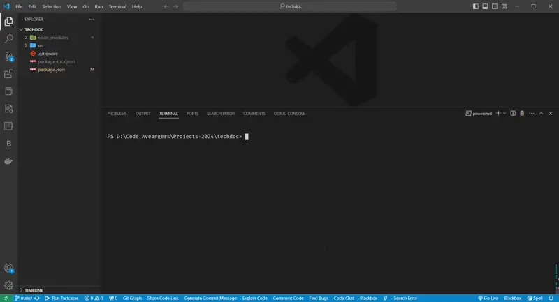

# TechDoc 🚀

Welcome to the extraordinary project that solves the problem of creating technical documentation for developers using cutting-edge technology and innovative solutions. This CLI tool generates README files with the help of AI or customizable templates, making the documentation process efficient and hassle-free.

## Table of Contents 📑

- [TechDoc 🚀](#techdoc-)
  - [Table of Contents 📑](#table-of-contents-)
  - [Introduction 📝](#introduction-)
  - [Key Features 💡](#key-features-)
  - [Getting Started 🚀](#getting-started-)
  - [Installation 🌐](#installation-)
  - [Usage 🎬](#usage-)
  - [Detailed Documentation 📚](#detailed-documentation-)

## Introduction 📝

This CLI tool is designed to simplify the process of creating technical documentation for developers. By leveraging AI or customizable templates, users can quickly generate README files for their projects, saving time and effort in the documentation process.

## Key Features 💡

- AI-powered README generation
- Customizable templates for different project types
- Easy-to-use command-line interface
- Efficient and accurate documentation creation
- Support for various programming languages and frameworks

## Getting Started 🚀

To get started with the CLI tool, simply follow the installation instructions and start generating README files for your projects in no time.

## Installation 🌐

To install the CLI tool, you can use the following command:

```
npm install -g techdoc
```

This will install the tool globally on your system, allowing you to access it from anywhere in your terminal.

## Usage 🎬

Once installed, you can use the CLI tool by running the following command:

```
techdoc init
```

This will prompt you to select a template or use AI to generate a README file for your project.

For AI generation you have to pass your `Open AI` api key which is free for some time



## Detailed Documentation 📚

After initiation, you have to fill the details asked like details of project and exclude folders and others . Once done with that, you can generate documentation by selecting one, later you can also generate other document by running `techdoc  init`
